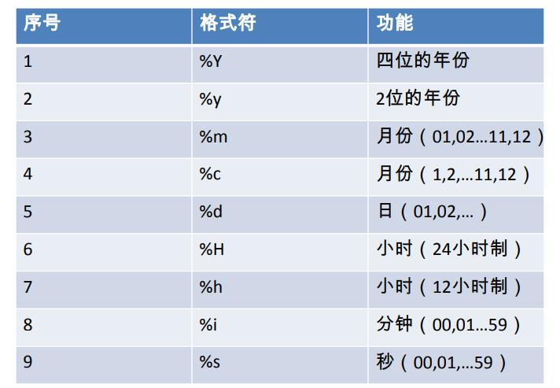

# 单行函数
## 字符函数
1. length 获取参数值的字节个数
	SELECT LENGTH('张三丰hahaha');
2. concat 拼接字符串
	SELECT CONCAT(last_name,'_',first_name) 姓名 FROM employees;
3. upper、lower
	SELECT CONCAT(UPPER(last_name),LOWER(first_name))  姓名 FROM employees;
4. substr、substring
	SELECT SUBSTR('李莫愁爱上了陆展元',7)  out_put;
	SELECT SUBSTR('李莫愁爱上了陆展元',1,3) out_put;
5. instr 返回子串第一次出现的索引，如果找不到返回0
	SELECT INSTR('杨不殷六侠悔爱上了殷六侠','殷八侠') AS out_put;
6. trim去除两端该去掉的
	SELECT LENGTH(TRIM('    张翠山    ')) AS out_put;
	SELECT TRIM('a' FROM 'aaaaaaaaa张aaaaaaaaaaaa翠山aaaaaaaaaaaaaaaaaaaaaaaaaaaaaaaaaaaaa')  AS out_put; -- 去掉两端的a
7. lpad 用指定的字符实现左填充指定长度
	SELECT LPAD('殷素素',12,'*') AS out_put;
8. rpad 用指定的字符实现右填充指定长度
	SELECT RPAD('殷素素',12,'ab') AS out_put;
9. replace 替换
	SELECT REPLACE('周芷若周芷若周芷若周芷若张无忌爱上了周芷若','周芷若','赵敏') AS out_put;
## 数学函数
1. round 四舍五入
	SELECT ROUND(-1.55);
	SELECT ROUND(1.567,2);
2. ceil 向上取整,返回>=该参数的最小整数
	SELECT CEIL(-1.02);
3. floor 向下取整，返回<=该参数的最大整数
	SELECT FLOOR(-9.99);
4. truncate 截断
	SELECT TRUNCATE(1.69999,1);
5. mod取余
	SELECT MOD(10,-3);
	SELECT 10%3;
## 日期函数
1. now 返回当前系统日期+时间
	SELECT NOW();
2. curdate 返回当前系统日期，不包含时间
	SELECT CURDATE();
3. curtime 返回当前时间，不包含日期
	SELECT CURTIME();
4. 可以获取指定的部分，年、月、日、小时、分钟、秒
	SELECT YEAR(NOW()) 年;
	SELECT YEAR('1998-1-1') 年;
	SELECT YEAR(hiredate) 年 FROM employees;
	SELECT MONTH(NOW()) 月;
	SELECT MONTHNAME(NOW()) 月; -- 显示当前月份的名称
5. str_to_date 将字符通过指定的格式转换成日期
	SELECT STR_TO_DATE('1998-3-2','%Y-%c-%d') AS out_put;
	
6. date_format 将日期转换成字符
	SELECT DATE_FORMAT(NOW(),'%y年%m月%d日') AS out_put;
## 其它函数
	SELECT VERSION();
	SELECT DATABASE();
	SELECT USER();
## 流程控制函数
1. if函数： if else 的效果
	SELECT IF(10<5,'大','小');
	SELECT last_name,commission_pct,IF(commission_pct IS NULL,'没奖金，呵呵','有奖金，嘻嘻') 备注
	FROM employees;
2. case函数的使用一： switch case 的效果
	SELECT salary 原始工资,department_id,
	CASE department_id
	WHEN 30 THEN salary*1.1
	WHEN 40 THEN salary*1.2
	WHEN 50 THEN salary*1.3
	ELSE salary
	END AS 新工资
	FROM employees;
3. case 函数的使用二：类似于 多重if
	SELECT salary,
	CASE 
	WHEN salary>20000 THEN 'A'
	WHEN salary>15000 THEN 'B'
	WHEN salary>10000 THEN 'C'
	ELSE 'D'
	END AS 工资级别
	FROM employees;
===========================================================
# 分组函数
1. 简单使用
	SELECT SUM(salary) 和,ROUND(AVG(salary),2) 平均,MAX(salary) 最高,MIN(salary) 最低,COUNT(salary) 个数
FROM employees;
2. 和distinct搭配
	SELECT SUM(DISTINCT salary),SUM(salary) FROM employees;
	SELECT COUNT(DISTINCT salary),COUNT(salary) FROM employees;
3. 和分组函数一同查询的字段有限制
	SELECT AVG(salary),employee_id  FROM employees; --不推荐使用这种查询方式，分组函数只返回一行
	